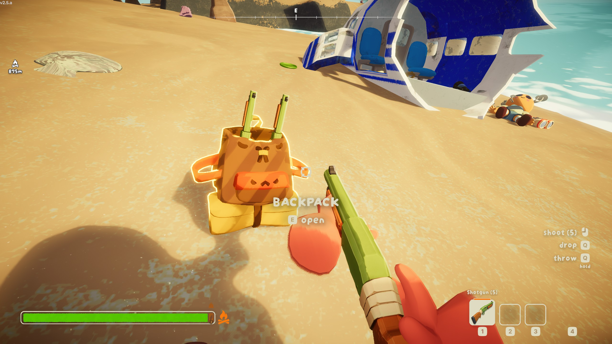
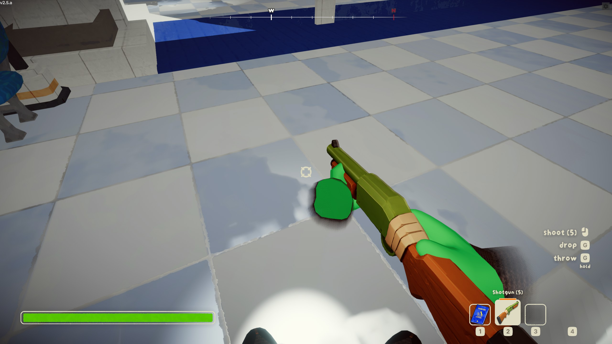
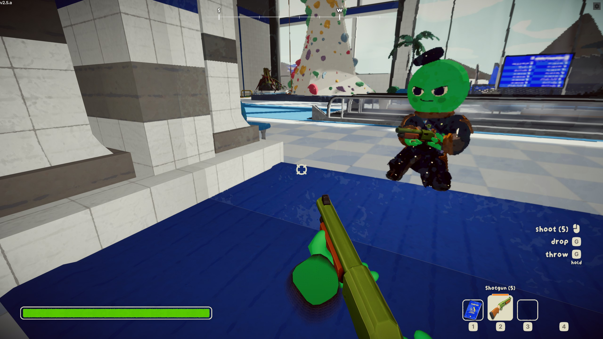

# peak-shotgun







Turns PEAK's leftover blowgun into a shotgun.

A blast throws eight pellets in a short cone, about every 0.85 seconds. Scouts who are hit take a heavy Injury and get flipped. Zombies ignore Injury. The first hit flips them and adds Drowsy. The second hit knocks them out, and they stay down until PEAK kills them. See the [zombie page](https://peak.wiki.gg/wiki/Zombie).

## Requirements

- BepInExPack for PEAK
- [PEAKLib Core](https://thunderstore.io/c/peak/p/PEAKModding/PEAKLib_Core/)
- [PEAKLib Items](https://thunderstore.io/c/peak/p/PEAKModding/PEAKLib_Items/)

PEAK does not include a shotgun model. The mod builds the gun from the blowgun already in the game, names it Shotgun, and makes it fire on its own. Installing the mod is the whole setup.

## Install

1. Install the package with r2modman / Gale, **or** drop `PeakShotgun.dll` into `BepInEx/plugins/PeakShotgun/`.
2. Launch PEAK from r2modman. Starting the game from Steam skips BepInEx.

## How to test

1. Host a run. On the Shore, three zombies appear near you, and a Shotgun is on the ground in front of you. Shore and Roots luggage also contain one. It looks like the blowgun, because that is the model PEAK ships. It does not replace the blowgun.
2. Press primary fire. It shoots a spread of pellets about every 0.85 seconds and plays the blowgun shot. Each shotgun has 5 shots. After one launch, change `Shots` under `[Shotgun]` in the PeakShotgun config file in `BepInEx/config`.
3. Shoot another scout. They take a heavy Injury and get flipped. You cannot hit yourself.
4. Shoot a zombie on the Shore. The first blast flips it, and it can get back up. The second blast knocks it out, and it stays down.

## Build

Requires [PEAK](https://store.steampowered.com/app/3527290/PEAK/) installed (auto-detected under common Steam paths), or set `PEAK_GAME_DIR` / `-p:PeakGameRootDir=`.

```bash
dotnet build Peak.Shotgun.slnx -c Release
```

Optional deploy: `-p:DeployToPeak=true -p:PeakPluginsDir="/path/to/BepInEx/plugins/PeakShotgun"`  
Optional overrides: copy `Config.Build.user.props.example` → `Config.Build.user.props` (gitignored).

The DLL is `artifacts/bin/PeakShotgun/release/PeakShotgun.dll`.

## Developers

[AGENTS.md](AGENTS.md) is the code map: what each type does, where icons and sounds live, and how zombie knockdown and ammo work.

## Thunderstore packaging (CI)

Every push to `master` runs [.github/workflows/thunderstore.yml](.github/workflows/thunderstore.yml):

1. Builds a Thunderstore ZIP (using stripped [PEAKGameLibs](https://www.nuget.org/packages/PEAKGameLibs) for compile references)
2. Uploads a workflow artifact named **`FakeGameDevelopers-PeakShotgun`**

Every push still builds that zip. Thunderstore publish runs only when `<Version>` in `src/PeakShotgun/Peak.Shotgun.csproj` changes, and the organization secret `TCLI_AUTH_TOKEN` is set. The publish step copies the categories already on the package, so a new version keeps the same tags. A commit that leaves the version unchanged only builds the artifact.

### Local package build

```bash
./build.sh
# or: dotnet build Peak.Shotgun.slnx -c Release -target:PackTS
# zip lands in artifacts/thunderstore/
```

## Credits

- Original author: **Arman Ossi Loko**
- This mod belongs to **Fake Game Developers**
- Based on [Peak_AKGun](https://github.com/TheCodinPro/Peak_AKGun) by TheCodinPro

Work based on this mod must credit Arman Ossi Loko and Fake Game Developers. See [LICENSE](LICENSE).
